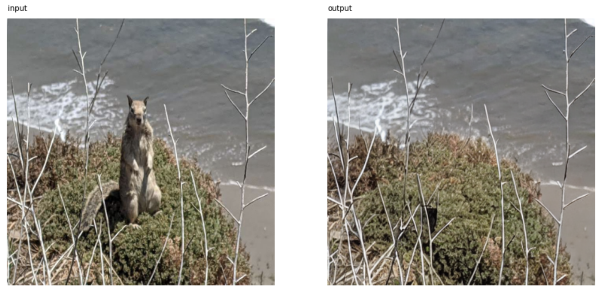
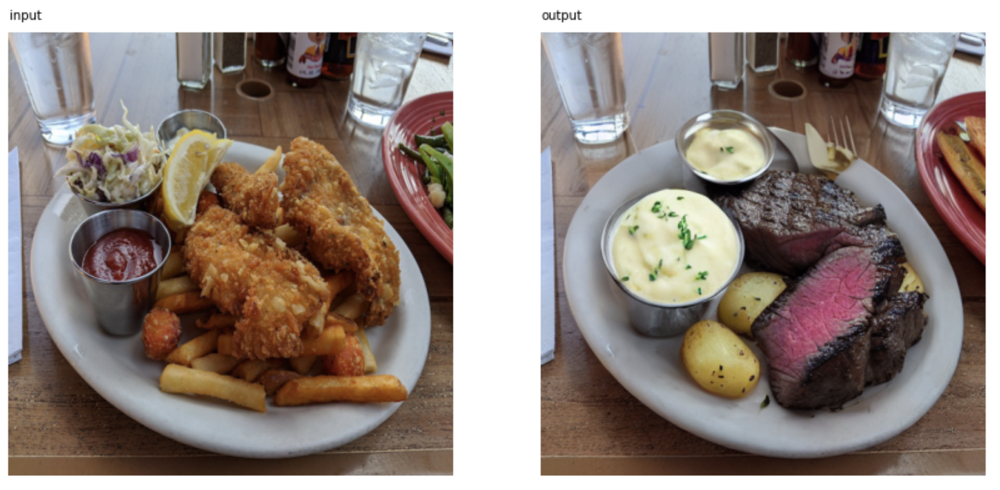

# text-inpainting
This repo allows you to perform image editing via text prompts, without needing to manually draw a mask image of the parts you want to edit (mask generation is automatic). All you need is an input image, what you want to replace/remove, and optionally its replacement.

## Examples

### Removing An Object

With the prompt "squirrel":

### Replacing An Object With Another

With the prompt "food" to identify the object to be removed, and the prompt "steak and potatoes" as the replacement:

## Usage

The best way to get started is to open up `quickstart.ipynb` in a Google Colab notebook with the GPU setting turned on. The notebook walks you through several different examples.
