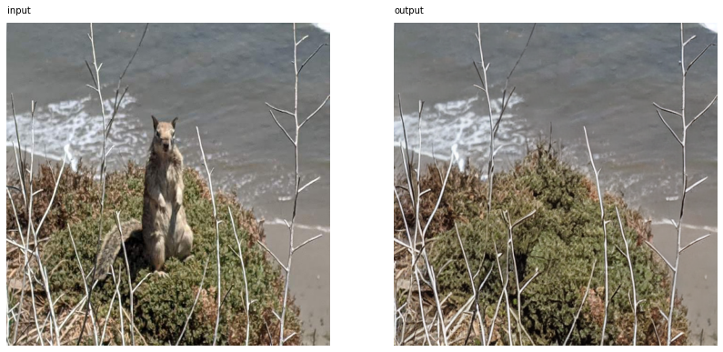
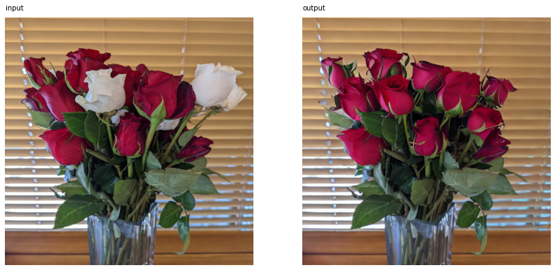
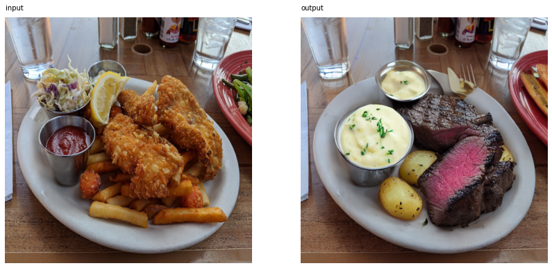
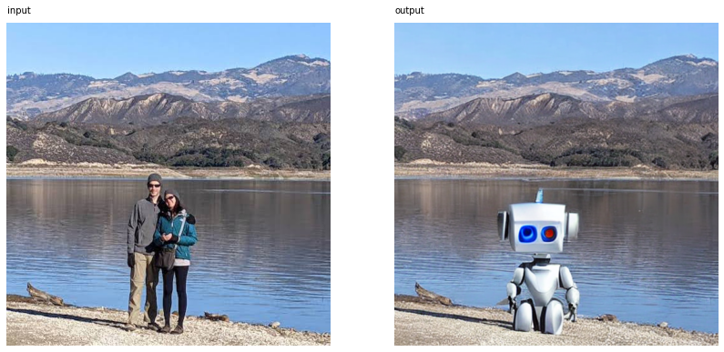

# Text-Guided Image Inpainting

This repo allows you to perform **image editing via text prompts**, without needing to manually draw a mask image of the parts you want to edit (mask generation is automatic). All you need is an input image and text prompts of what you want to remove and replace with.

To do so, this inpainting tool uses an image segmentation model called **CLIPSeg** ([GitHub](https://github.com/timojl/clipseg) | [Paper](https://arxiv.org/abs/2112.10003)). This model can perform image segmentation of arbitrary text prompts at test time. It uses OpenAI's pre-trained CLIP model ([GitHub](https://github.com/openai/CLIP) | [Paper](https://arxiv.org/abs/2103.00020)) to convert a text prompt and user-inputted image into CLIP embeddings, which then get fed into a decoder. [Here](https://github.com/timojl/clipseg/raw/master/overview.png) is a great diagram explaining how the model works.

Then a latent text-to-image diffusion model is used: **Stable-Diffusion-Inpainting** ([HuggingFace Model Card](https://huggingface.co/runwayml/stable-diffusion-inpainting)), which was initialized with Stable-Diffusion-v-1-2 weights and given inpainting training. Using the diffusion model, this inpainting tool takes the user-inputted image, mask image (from CLIPSeg), and inpainting prompt and outputs the final image.

## Usage

The best way to get started is to open up `quickstart.ipynb` in a Google Colab notebook with the GPU setting turned on. The notebook walks you through several different examples.

## Examples

### Removing An Object (Squirrel)

    input_filepath = 'images/squirrel.jpg'
    mask_prompt = 'squirrel'
    inpaint_prompt = ''

### Changing Color (Roses)

    input_filepath = 'images/roses.jpg'
    mask_prompt = 'white roses'
    inpaint_prompt = 'red roses'

### Replacing Objects (Food)

    input_filepath = 'images/food.jpg'
    mask_prompt = 'food'
    inpaint_prompt = 'steak and potatoes'

### Replacing Objects (People)

    input_filepath = 'images/lake.jpg'
    mask_prompt = 'people'
    inpaint_prompt = 'robot'

